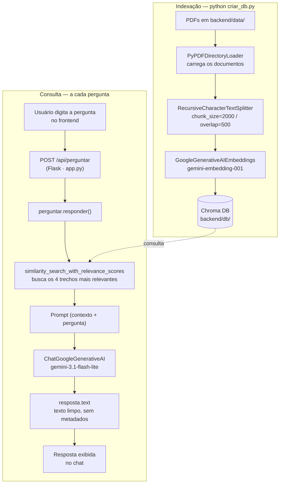

# Ginga · Assistente de IA da Ginga Tech

Assistente conversacional que responde perguntas sobre o catálogo fictício da
**Ginga Tech** (formações, preços, carga horária, carreiras, requisitos técnicos
e políticas institucionais) usando **RAG (Retrieval-Augmented Generation)**.

O agente não "inventa" respostas: ele busca os trechos mais relevantes do
catálogo em PDF e só responde com base no que encontra ali. Se a informação
não estiver no documento, ele diz isso claramente em vez de alucinar.

---
**PROJETO NO AR:** aplicação online (Deploy no Render, por ser gratuito demora um pouco para ele "acordar". Geralmente de 30 a 60 segundos) 
(https://gingatech.onrender.com)

## 1. Descrição geral do projeto

O projeto tem duas partes:

- **Backend (Python)** — um pipeline de RAG que lê o PDF do catálogo da Ginga
  Tech, transforma o conteúdo em vetores semânticos (embeddings) e os guarda
  em um banco vetorial local (Chroma). Uma API Flask expõe esse pipeline via
  HTTP para que qualquer cliente possa fazer perguntas.
- **Frontend (HTML/CSS/JS puro)** — uma interface de chat que conversa com a
  API, sem nenhum framework, pronta para ser aberta direto no navegador ou
  servida pelo próprio Flask.

Na prática, o fluxo é: o aluno (ou candidato) pergunta algo em linguagem
natural ("qual o valor do curso de IA?", "como funciona o reembolso?") e o
agente devolve uma resposta objetiva, escrita em texto corrido, citando os
dados reais do catálogo — valores, cargas horárias, políticas, etc.

## 2. Arquitetura da solução

O projeto segue o padrão clássico de RAG, dividido em dois momentos:
**indexação** (feita uma vez, offline) e **consulta** (feita a cada pergunta,
em tempo real).



**Por que RAG?** Em vez de depender só do conhecimento geral do modelo (que
não sabe nada sobre a Ginga Tech), a aplicação busca o trecho certo do
catálogo antes de gerar a resposta. Isso reduz alucinações e garante que
preços, prazos e políticas batam com o documento oficial.

### Estrutura de pastas

```
ginga-tech/
├── backend/
│   ├── data/                 # PDFs da base de conhecimento (catálogo da Ginga Tech)
│   ├── db/                   # base vetorial Chroma (gerada localmente, não versionada)
│   ├── criar_db.py           # indexação: lê os PDFs em data/ e popula db/
│   ├── perguntar.py          # lógica de busca + geração da resposta (responder())
│   ├── app.py                 # API Flask: serve o frontend e o endpoint /api/perguntar
└── frontend/
    ├── index.html             # estrutura do chat
    ├── style.css              # visual (tema Ginga Tech)
    └── script.js              # consome a API via fetch()
```

## 3. Tecnologias e ferramentas utilizadas

**Backend / IA**
- **Python 3**
- **LangChain** (`langchain-community`, `langchain-text-splitters`,
  `langchain-core`) — orquestração do pipeline de RAG
- **langchain-chroma** + **ChromaDB** — banco de dados vetorial local
- **langchain-google-genai** — integração com a API do Gemini
  - Embeddings: `gemini-embedding-001`
  - Chat: `gemini-3.1-flash-lite`
- **pypdf** — leitura dos arquivos PDF
- **Flask** + **Flask-CORS** — API HTTP
- **python-dotenv** — variáveis de ambiente (chave da API)

**Frontend**
- **HTML5**, **CSS3** e **JavaScript** puros (sem frameworks)
- `fetch()` nativo para consumir a API
- Google Fonts (Space Grotesk, Inter, IBM Plex Mono)

## 4. Instruções para executar o projeto

### Pré-requisitos
- Python 3.10+
- Uma chave de API do Gemini, gerada em https://aistudio.google.com/apikey

### Passo a passo

```bash
# 1. Entre na pasta do backend
cd backend

# 2. (Recomendado) crie um ambiente virtual
python -m venv venv
source venv/bin/activate        # Windows: venv\Scripts\activate

# 3. Instale as dependências

# 4. Configure sua chave de API
.env
# edite o .env e coloque: GEMINI_API_KEY=sua_chave_aqui

# 5. Coloque seus PDFs em backend/data/
#    (o catálogo da Ginga Tech já vem incluso como exemplo)

# 6. Gere a base vetorial (repita sempre que os PDFs mudarem)
python criar_db.py

# 7. Suba o servidor
python app.py
```

Acesse **http://localhost:5000** no navegador — o frontend já é servido pelo
Flask e conversa com a API automaticamente.

Também é possível usar apenas o terminal, sem o frontend:

```bash
python perguntar.py
```

> **Nota:** se trocar o modelo de embedding no futuro, apague a pasta
> `backend/db/` antes de rodar `criar_db.py` de novo — embeddings gerados por
> modelos diferentes não são compatíveis entre si.

## 5. Exemplos de perguntas que o agente consegue responder

- "Quais são as formações disponíveis na Ginga Tech?"
- "Qual o valor do curso de Engenharia de IA Generativa e RAG?"
- "Como funciona a política de reembolso?"
- "Quais os requisitos de hardware para a trilha de DevOps e Cloud?"
- "Qual a diferença entre o Ginga Pass e um Bootcamp Individual?"
- "Quanto tempo dura o curso de Back-End com Java e Spring Boot?"
- "Vocês têm desconto para empresas que querem matricular uma equipe?"
- "É possível parcelar no boleto?"
- "Os certificados da Ginga Tech têm validade reconhecida?"

## 6. Exemplos de respostas geradas pelo agente

> As respostas seguem o estilo definido no prompt: sem Markdown, nomes de
> curso em MAIÚSCULAS, parágrafos curtos e listas com `•`, `->` ou números.

---

**Pergunta:** Qual o valor do curso de Engenharia de IA Generativa e RAG, e quanto tempo dura?

**Resposta:**
```
O curso ENGENHARIA DE IA GENERATIVA, AGENTES INTELIGENTES & RAG AVANÇADO (código GT-AI-GENAI) tem carga horária de 140 horas, com duração recomendada de 14 semanas.

Valores:

• À vista: R$ 2.450,00
• No Pix (10% de desconto): R$ 2.205,00
• Parcelado: 12x de R$ 204,16 sem juros

O curso cobre fundamentos de LLMs, embeddings e bancos vetoriais, arquitetura RAG avançada com LangChain e LlamaIndex, e agentes autônomos com LangGraph e CrewAI.
```

---

**Pergunta:** Como funciona a política de reembolso?

**Resposta:**
```
A Ginga Tech tem duas garantias diferentes, dependendo da modalidade:

1 GARANTIA INCONDICIONAL DE 7 DIAS (Art. 49 do CDC) -> vale para qualquer compra. O aluno pode cancelar em até 7 dias corridos após a matrícula e recebe 100% do valor de volta, sem multa. O estorno no Pix sai no mesmo dia, e no cartão em até 48 horas úteis.

2 GARANTIA CONDICIONAL DE 30 DIAS -> exclusiva para Bootcamps Individuais. Se o aluno assistir a até 20% do curso, entregar o primeiro exercício prático e ainda assim considerar que o conteúdo não atendeu às expectativas, pode pedir reembolso total em até 30 dias corridos, após um alinhamento com a coordenação pedagógica.
```

---

**Pergunta:** Quais os requisitos de hardware para a trilha de DevOps e Cloud?

**Resposta:**
```
Para a trilha DEVOPS & CLOUD (K8s/AWS), o recomendado é:

• Processador: Intel Core i5 / Ryzen 5 / Apple M2 ou superior
• Memória RAM: de 16 GB a 32 GB
• Armazenamento: 40 GB livres em SSD

A observação do catálogo é que o computador precisa rodar múltiplos containers e clusters locais (como Kind ou Minikube) ao mesmo tempo, então quanto mais RAM disponível, melhor a experiência.
```

---

**Pergunta:** Vocês ensinam Rust?

**Resposta:**
```
Não encontrei isso nos dados. O catálogo da Ginga Tech cobre Java, TypeScript/JavaScript, Python, Go (Golang) e C# (.NET), mas não há nenhuma formação de Rust listada no momento.
```

---

## Stack resumida

Python · LangChain · Chroma · Gemini API (`gemini-embedding-001` + `gemini-3.1-flash-lite`) · Flask · HTML · CSS · JavaScript
